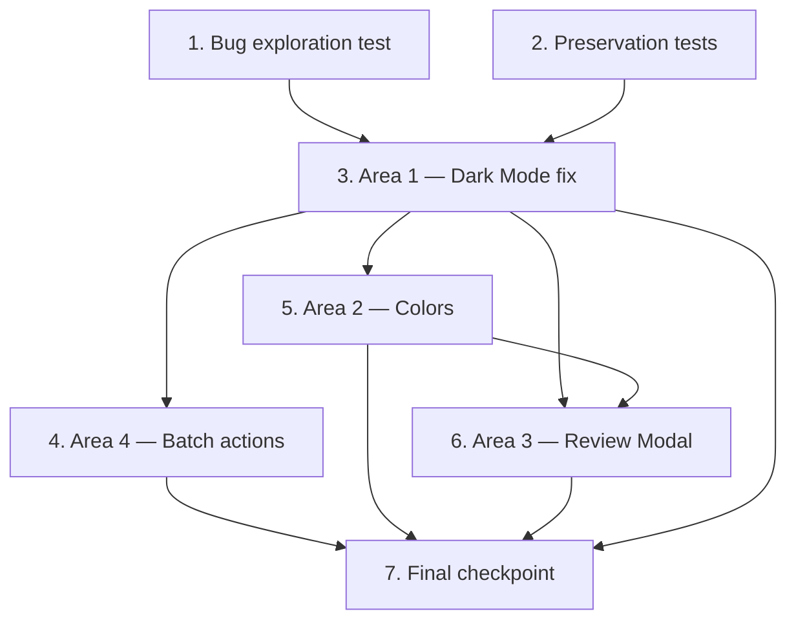

# Implementation Plan

All tasks below are frontend-only, confined to `omniscan-ui/src/` — no `nitro-app` backend changes. Every task references the requirement clauses and correctness properties from the design. Verification uses `vue-tsc --noEmit` as the automated gate (the terminal is flaky, so type checking via the vue-tsc binary with file-based output is the primary automated check); the rest is behavioral verification in the browser. Ordering: Area 1 (Dark Mode), Area 4 (Batch actions), Area 2 (Colors), Area 3 (Detailed Review Modal — largest), then final verification.

## Overview

This plan covers four frontend-only polish areas in `omniscan-ui`, all verified via `vue-tsc --noEmit`:

- **Area 1 — Dark Mode fix**: stop the theme from reverting to light on load/navigation in `AdminSettings.vue`.
- **Area 2 — Color harmonization**: align semantic color tokens across card, badge, and filter in `VerificationPanel.vue`.
- **Area 3 — Detailed Review Modal**: consolidate the review flow into a single modal (zoomable images, un-truncated AI notes, certifying-body selector) in `VerificationPanel.vue`.
- **Area 4 — Batch streamlining**: reduce the batch toolbar to only Send Inactivity Notice in `AdminManageUserProfile.vue`.

## Tasks

- [x] 1. Write bug condition exploration test — Dark Mode revert
  - **Property 1: Bug Condition** - Dark Mode Persists Across Load and Navigation
  - **CRITICAL**: This test MUST FAIL on unfixed code - failure confirms the bug exists
  - **DO NOT attempt to fix the test or the code when it fails**
  - **NOTE**: This test encodes the expected behavior — it will validate the fix when it passes after implementation
  - **GOAL**: Surface counterexamples that demonstrate the dark-mode revert bug exists in `fetchSettings()`
  - **Scoped PBT Approach**: The bug is deterministic. Scope the property to the concrete failing cases: `localStorage[omniscan_dark_mode] === 'true'` combined with a backend `/api/admin/settings` response where `darkMode` is (a) absent and (b) `false`. Generalize over the backend payload's other fields.
  - Encode `isBugCondition(input)` from the design: `darkModeEnabled = true AND navigatedTo IN { Dashboard, Settings } AND backendDarkMode <> true`
  - Simulate `fetchSettings()` in `omniscan-ui/src/views/admin/AdminSettings.vue`: with localStorage dark = `true`, run the merge (`Object.assign(form, data)`) then the current `applyDarkMode(form.darkMode)` path
  - Assertion (Expected Behavior): after the load flow, `document.documentElement` still carries the `ion-palette-dark` class AND `form.darkMode` reflects the localStorage value
  - Run test on UNFIXED code
  - **EXPECTED OUTCOME**: Test FAILS (this is correct — it proves the bug: `Object.assign` overwrites `form.darkMode` with stale/absent backend value, `applyDarkMode(false)` strips `ion-palette-dark`)
  - Document counterexamples found (e.g., "backend returns `{}` → `form.darkMode` becomes falsy → `ion-palette-dark` removed → theme reverts to light")
  - Mark task complete when test is written, run, and failure is documented
  - _Requirements: 1.1, 1.2, 2.1, 2.2_

- [x] 2. Write preservation property tests — Non-buggy theme and panel behavior (BEFORE implementing fix)
  - **Property 2: Preservation** - Non-Buggy Theme and Panel Behavior
  - **IMPORTANT**: Follow observation-first methodology — observe behavior on UNFIXED code for inputs where `isBugCondition` returns false, then encode those observations as property-based tests
  - Cases where the bug condition does NOT hold (from design Preservation Requirements):
    - Dark Mode OFF: observe `ion-palette-dark` absent before/after load; toggling off from on applies immediately (light mode renders)
    - Backend value already `true`: observe theme stays dark and `form.darkMode` stays `true`
    - App-boot re-apply: observe `App.vue` `onMounted` re-applies the class from localStorage on reload (unchanged — no edit to `App.vue`)
    - Verification Panel: observe "Certified / Resolved" renders green; observe `verdictClass` / `confidenceClass` / `statusClass` / `statusLabel` / `filteredRows` / `counts` produce identical output across a representative sample of rows/verdicts/statuses
  - Write property-based tests capturing these observed patterns: for all settings responses with localStorage `true`, applied theme equals localStorage (dark stays dark); for all sample rows, helper outputs are unchanged
  - Run tests on UNFIXED code
  - **EXPECTED OUTCOME**: Tests PASS (confirms baseline behavior to preserve)
  - Mark task complete when tests are written, run, and passing on unfixed code
  - _Requirements: 3.1, 3.2, 3.3, 3.4, 3.5_

- [x] 3. Area 1 — Fix Dark Mode revert in `AdminSettings.vue`

  - [x] 3.1 Implement the localStorage-authoritative reconciliation in `fetchSettings()`
    - File: `omniscan-ui/src/views/admin/AdminSettings.vue`
    - Capture `const localDarkMode = localStorage.getItem(DARK_MODE_KEY) === 'true'` BEFORE the `/api/admin/settings` GET
    - After `Object.assign(form, data)`, set `form.darkMode = localDarkMode`, then call `applyDarkMode(form.darkMode)` so a stale/absent backend value can never downgrade the applied theme (localStorage is the source of truth)
    - Leave `handleSave` PUTting the full `form` (including `form.darkMode`) as a best-effort backend persist — UNCHANGED
    - Leave `watch(() => form.darkMode, applyDarkMode)` UNCHANGED (no spurious revert now that `fetchSettings` sets the local value)
    - Leave `onMounted` seeding of `form.darkMode` from localStorage UNCHANGED
    - Leave `App.vue` boot re-apply UNCHANGED (no per-view Dashboard logic added)
    - _Bug_Condition: isBugCondition(input) where darkModeEnabled = true, navigatedTo IN { Dashboard, Settings }, backendDarkMode <> true_
    - _Expected_Behavior: after fetchSettings', documentElement retains ion-palette-dark and form.darkMode reflects localStorage_
    - _Preservation: light mode when off, App.vue boot re-apply, dark-mode.css overrides, green certified, filter/label helpers_
    - _Requirements: 2.1, 2.2_

  - [x] 3.2 Verify bug condition exploration test now passes
    - **Property 1: Expected Behavior** - Dark Mode Persists Across Load and Navigation
    - **IMPORTANT**: Re-run the SAME test from task 1 — do NOT write a new test
    - Run the bug condition exploration test from step 1 against the fixed `fetchSettings()`
    - **EXPECTED OUTCOME**: Test PASSES (confirms `ion-palette-dark` stays applied for backend-absent and backend-false responses)
    - _Requirements: 2.1, 2.2_

  - [x] 3.3 Verify preservation tests still pass
    - **Property 2: Preservation** - Non-Buggy Theme and Panel Behavior
    - **IMPORTANT**: Re-run the SAME tests from task 2 — do NOT write new tests
    - Confirm light-mode-off, backend-true, app-boot re-apply, green-certified, and helper outputs are unchanged
    - **EXPECTED OUTCOME**: Tests PASS (no regressions)

  - [x] 3.4 Type-check gate for Area 1
    - Run `vue-tsc --noEmit` over `omniscan-ui`; confirm zero type errors introduced in `AdminSettings.vue`

- [x] 4. Area 4 — Streamline batch actions in `AdminManageUserProfile.vue`

  - [x] 4.1 Remove Archive and Delete batch buttons and simplify `runBatch`
    - File: `omniscan-ui/src/views/admin/AdminManageUserProfile.vue`
    - Remove `<button class="batch-btn archive">` and `<button class="batch-btn delete">` from `.batch-buttons`; keep the Send Inactivity Notice button (`runBatch('notify')`)
    - Simplify `runBatch` to only handle `'notify'`: narrow the parameter type to `'notify'` and drop the `archive` / `delete` `window.confirm` branches (dead paths once buttons are gone)
    - Optionally remove now-unused `.batch-btn.archive` / `.batch-btn.delete` CSS (and their `:hover`) — non-behavioral cleanup
    - Backend `POST /api/admin/users/batch` UNCHANGED (still supports notify/archive/delete server-side)
    - _Bug_Condition: isBatchBug(toolbar) where toolbar.exposes("archive") OR toolbar.exposes("delete")_
    - _Expected_Behavior: for any non-empty selection, toolbar presents only Send Inactivity Notice_
    - _Preservation: notify path calls POST /api/admin/users/batch with action notify; server-side archive/delete support intact_
    - _Requirements: 2.7_

  - [x] 4.2 Verify Property 5 — batch toolbar exposes only Send Inactivity Notice
    - **Property 5: Batch Toolbar** - Only Send Inactivity Notice
    - Behavioral check: select users → only Send Inactivity Notice is shown (no Archive, no Delete anywhere in the toolbar)
    - Confirm clicking it still POSTs `notify` with the selected user IDs (payload unchanged)
    - **EXPECTED OUTCOME**: Toolbar exposes exactly {Send Inactivity Notice}; notify payload/endpoint preserved
    - _Requirements: 2.7, 3.8, 3.9_

  - [x] 4.3 Type-check gate for Area 4
    - Run `vue-tsc --noEmit` over `omniscan-ui`; confirm zero type errors introduced in `AdminManageUserProfile.vue` (including the narrowed `runBatch` parameter type)

- [x] 5. Area 2 — Harmonize Verification Panel colors in `VerificationPanel.vue`

  - [x] 5.1 Recolor the "Unverified Halal Logos" total card and align semantic tokens
    - File: `omniscan-ui/src/views/admin/VerificationPanel.vue`
    - Change the "Unverified Halal Logos" total metric card from the red family (`.summary-card.red`, `.red-bg`, `.red-text`) to the yellow/amber family (`.summary-card.yellow`, `.yellow-bg`, `.yellow-text`), matching "Pending Halal Review"
    - Keep "Pending Halal Review" yellow, "Certified / Resolved" green, "Logo Corrections" blue (informational)
    - Align amber tokens across `.summary-card.yellow`, `.pill-pending`, `.pill-flagged`, `.flag-capsule.yellow`, `.conf-yellow` (same palette); green tokens across `.summary-card.green`, `.pill-approved`, `.conf-green`; reserve red tokens for critical/blocked only (`.flag-capsule.red`, `.conf-red`)
    - Keep `verdictClass` / `confidenceClass` / `statusClass` / `statusLabel` logic UNCHANGED — only the class-to-color CSS mapping is aligned (no threshold or logic change)
    - _Bug_Condition: isColorBug(surface) where state = "Unverified/Pending" AND color = "red", OR sameState(a,b) AND a.color <> b.color_
    - _Expected_Behavior: card/badge/filter share one semantic token set (amber = unverified/pending, green = certified/resolved, red = critical/blocked only); red removed from the total card_
    - _Preservation: green for certified/resolved; verdictClass/confidenceClass/statusClass/statusLabel/filteredRows/counts unchanged_
    - _Requirements: 2.3, 2.4_

  - [x] 5.2 Verify Property 3 — consistent colors across card, badge, and filter
    - **Property 3: Color Semantics** - Consistent Across Card, Badge, and Filter
    - Behavioral check: total card no longer red (now amber/yellow); a given state reads the same color across metric card, table badge, and filter option
    - Confirm green still used for Certified / Resolved (preservation 3.4)
    - Confirm filters (All Halal Flags, All Verdicts, All Statuses) and helpers still filter/label rows correctly (preservation 3.5)
    - **EXPECTED OUTCOME**: Semantic table holds; red never appears on the backlog/total card
    - _Requirements: 2.3, 2.4, 3.4, 3.5_

  - [x] 5.3 Type-check gate for Area 2
    - Run `vue-tsc --noEmit` over `omniscan-ui`; confirm zero type errors introduced in `VerificationPanel.vue`

- [x] 6. Area 3 — Consolidate the Detailed Review Modal in `VerificationPanel.vue`

  - [x] 6.1 Single open path from [Review] button and flagged row
    - File: `omniscan-ui/src/views/admin/VerificationPanel.vue`
    - Open one modal from clicking the [Review] button OR clicking the flagged row; reuse the `GET /api/admin/flagged-scans/${id}` load (existing `openReviewDrawer` logic) and preserve the `reviewLoadingId` loading state
    - Add `@click.stop` on the per-row `[Review]` and `[Correct]` buttons so they do not double-fire the row `@click` handler
    - _Bug_Condition: isReviewBug(interaction) where surfacesNeeded > 1_
    - _Expected_Behavior: one modal opens from row OR [Review]; button clicks stopPropagation (no double open); reuses GET /api/admin/flagged-scans/[id] and preserves loading state_
    - _Preservation: certify/dismiss via halal logo library and existing endpoints; modal loads images/OCR/attribution from GET /api/admin/flagged-scans/[id]_
    - _Requirements: 2.5, 3.7_

  - [x] 6.2 Region (a) — hi-res zoomable images
    - Render the hi-res front/back scan images (`reviewFrontSrc` / `reviewBackSrc`) in the modal, zoomable via the existing lightbox (`openLightbox` / `lightboxSrc`)
    - Keep the lightbox Teleport as-is; keep the existing image `@error` fallback and "No image" placeholder
    - _Requirements: 2.5, 3.7_

  - [x] 6.3 Region (b) — fully un-truncated AI notes
    - Render `clean_flag_reason`, `flag_reason`, and `ocr_flag_reason` with no clamp
    - Remove the `.ocr-text { max-height: 160px; overflow-y: auto }` clamp (use no max-height, or a much larger cap) while keeping `white-space: pre-wrap; word-break: break-word`
    - Ensure `.flag-reason-text` stays un-clamped with `white-space: pre-wrap` so multi-line notes wrap fully
    - Ensure no `-webkit-line-clamp` or `text-overflow: ellipsis` is introduced
    - _Bug_Condition: isReviewBug(interaction) where notesTruncated = true_
    - _Expected_Behavior: flag_reason / clean_flag_reason / ocr_flag_reason shown fully un-truncated_
    - _Requirements: 2.6_

  - [x] 6.4 Region (c) — certifying-body selector + actions
    - Fold in the existing halal logo library grid (`halalLogos`, `modalSelectedLogoId`), the admin note (`modalNote`), and the Certify & Resolve (`submitCorrection`) / Dismiss (`submitDismiss`) actions
    - Reuse `openCorrectionModal` state seeding so `modalRow` / detail drive both the read-only sections and the action selector within one container
    - Preserve `modalError` handling and the `modalActing` guard (no close mid-request)
    - _Expected_Behavior: interactive certifying-body selector with Certify & Resolve / Dismiss inside the single modal_
    - _Preservation: certify/dismiss send identical payloads to the same endpoints via the halal logo library_
    - _Requirements: 2.5, 3.6_

  - [x] 6.5 Retire the redundant standalone Review drawer
    - Remove the standalone Review drawer markup (`drawer-overlay` / `drawer` / `drawer-footer` with "Open Correction Modal") once its sections live in the modal
    - Keep exactly one modal container; keep the lightbox Teleport; all changes contained to `VerificationPanel.vue`; no backend changes
    - _Expected_Behavior: single review surface (modal); drawer bridge removed_
    - _Requirements: 2.5_

  - [x] 6.6 Verify Property 4 — single surface, un-truncated notes
    - **Property 4: Detailed Review Modal** - Single Surface, Un-truncated Notes
    - Behavioral check: click the row AND separately the [Review] button → one modal opens with image, selector, and full `flag_reason` / `clean_flag_reason` / `ocr_flag_reason` (no clamp; long OCR fully readable via wrap/scroll, not cut off)
    - Confirm the per-row buttons `stopPropagation` (no double open)
    - Confirm image zooms via lightbox; certifier selection + Certify & Resolve / Dismiss work; loading state preserved
    - **EXPECTED OUTCOME**: One modal satisfies the full review flow; notes un-truncated; endpoints/payloads preserved
    - _Requirements: 2.5, 2.6, 3.6, 3.7_

  - [x] 6.7 Type-check gate for Area 3
    - Run `vue-tsc --noEmit` over `omniscan-ui`; confirm zero type errors introduced in `VerificationPanel.vue` after consolidation and drawer removal

- [x] 7. Checkpoint — Final verification
  - Run `vue-tsc --noEmit` over `omniscan-ui` and confirm zero type errors for the three modified `.vue` files (`AdminSettings.vue`, `VerificationPanel.vue`, `AdminManageUserProfile.vue`). Because the terminal is flaky, invoke the vue-tsc binary and read its file-based output rather than relying on interactive terminal state.
  - Behavioral checklist:
    - Dark mode persists across Settings → Dashboard → Settings and across reload
    - "Unverified Halal Logos" total card is no longer red; card / badge / filter colors are consistent per the semantic table
    - Detailed Review Modal opens from both the flagged row and the [Review] button; image zooms; AI notes are fully visible (not clamped); certifier selection + Certify & Resolve / Dismiss work
    - Batch toolbar shows only Send Inactivity Notice (no Archive, no Delete)
  - Ensure all exploration and preservation tests pass; ask the user if questions arise
  - _Requirements: 2.1, 2.2, 2.3, 2.4, 2.5, 2.6, 2.7, 3.1, 3.2, 3.3, 3.4, 3.5, 3.6, 3.7, 3.8, 3.9_

## Task Dependency Graph

Task 1 (bug exploration test) and Task 2 (preservation tests) are written first, before any fix. Task 3 (Area 1 — Dark Mode fix) depends on both 1 and 2 being in place. Tasks 4 (Area 4), 5 (Area 2), and 6 (Area 3) are independent of each other and may proceed after Task 3 — they touch different concerns: Task 4 is in `AdminManageUserProfile.vue`, while Tasks 5 and 6 both touch `VerificationPanel.vue`, so 5 is done before 6 to reduce churn on that file. Task 7 (final checkpoint) depends on 3, 4, 5, and 6.



Note: the `5 --> 6` edge reflects file-churn ordering (both edit `VerificationPanel.vue`), not a hard behavioral dependency; 4, 5, and 6 are otherwise independent concerns.

```json
{
  "waves": [
    { "wave": 1, "name": "Tests first", "tasks": ["1", "2"] },
    { "wave": 2, "name": "Area 1 — Dark Mode fix", "tasks": ["3"] },
    { "wave": 3, "name": "Area 4 & Area 2", "tasks": ["4", "5"] },
    { "wave": 4, "name": "Area 3 — Review Modal", "tasks": ["6"] },
    { "wave": 5, "name": "Final checkpoint", "tasks": ["7"] }
  ],
  "dependencies": {
    "1": [],
    "2": [],
    "3": ["1", "2"],
    "4": ["3"],
    "5": ["3"],
    "6": ["3", "5"],
    "7": ["3", "4", "5", "6"]
  }
}
```

## Notes

- All changes are frontend-only in `omniscan-ui`; there are no `nitro-app` backend changes.
- `vue-tsc --noEmit` is the automated gate. Because the terminal is flaky, it is run by invoking the vue-tsc binary with file-based output rather than relying on interactive terminal state.
- The backend endpoints `POST /api/admin/users/batch` and `GET /api/admin/flagged-scans/[id]` are reused unchanged (server-side notify/archive/delete support and flagged-scan detail loading remain intact).
